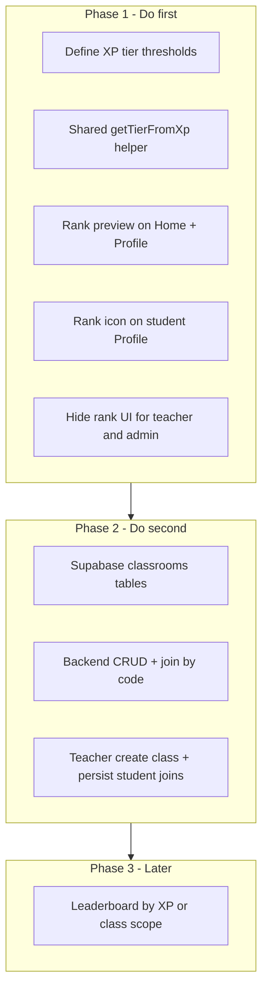

# What to build first: recommended order

## Two concepts today (you chose to merge them)

| Today in code | Meaning |
|---------------|---------|
| `user.tier` + `user.xp` on [`profiles`](backend/supabase/migrations/001_profiles.sql) | Gamification rank (Bronze, Silver, …) — **this is your single rank system** |
| Home stat **"Class rank"** → `N/A` in [`Home.tsx`](front-end/src/pages/dashboard/Home.tsx) | Placeholder for class leaderboard — **should be replaced**, not built out separately |
| [`Leaderboard.tsx`](front-end/src/pages/dashboard/Leaderboard.tsx) | Empty mock table (score/penalty/solved) — optional later; not the student’s identity rank |

You want **one rank driven by XP**. That simplifies priority: do **XP rank UX + role rules** before investing in classrooms.



---

## Phase 1 first: XP rank preview + profile icon + remove rank for staff

**Why first**

- Small, shippable in the existing stack: `xp` / `tier` already exist on [`profiles`](backend/supabase/migrations/001_profiles.sql) and flow through [`auth.ts`](backend/src/routes/auth.ts) into the front-end store.
- No new tables or APIs required for v1 (tier can be **derived from XP** in the client; optional later: compute on the server when XP changes).
- Immediately fixes confusing UI: header badge in [`DashboardLayout.tsx`](front-end/src/layouts/DashboardLayout.tsx) shows tier/XP for **any** user with `tier` set; [`Profile.tsx`](front-end/src/pages/dashboard/Profile.tsx) shows tier for everyone.
- Replaces the misleading **"Class rank"** stat on Home with XP-based preview (per your merge choice).

**Concrete work**

1. **Tier ladder** — new module e.g. [`front-end/src/lib/ranks.ts`](front-end/src/lib/ranks.ts):
   - Thresholds (example): Bronze 0, Silver 1000, Gold 2500, Platinum 5000 (you can adjust).
   - `getRankFromXp(xp)` → `{ currentTier, nextTier, xpToNext, progressPercent }`.
   - Prefer **deriving** display tier from XP instead of trusting stale `user.tier` until XP updates are implemented.

2. **Rank preview (students only)**
   - [`Profile.tsx`](front-end/src/pages/dashboard/Profile.tsx): progress bar + “X XP to {nextTier}” + rank icon/badge next to avatar.
   - [`Home.tsx`](front-end/src/pages/dashboard/Home.tsx): rename **Class rank** → **Rank** (or **Tier**); show current tier + XP to next (same helper).

3. **Rank icon on student profile**
   - Lucide medal/shield or small SVG per tier; map tier → icon/color in `ranks.ts`.
   - Optional: same small icon in header avatar area for students only.

4. **Remove rank for teacher and admin**
   - [`DashboardLayout.tsx`](front-end/src/layouts/DashboardLayout.tsx): show `{tier} · {xp} XP` only when `user.role === 'student'`.
   - [`Profile.tsx`](front-end/src/pages/dashboard/Profile.tsx): students see XP + tier + preview; teachers/admins see name/username only (no tier block, no rank icon).
   - [`Home.tsx`](front-end/src/pages/dashboard/Home.tsx): omit rank stat card for non-students (keep Problems solved / Active classes / Streak as needed).

**Gap to flag:** XP is not incremented on accepted submissions yet (mock judge only). Preview UI still works with current `user.xp` from Supabase; wire `addSubmission` → XP later so ranks feel alive.

---

## Phase 2 second: Classroom system

**Why not first**

- Larger scope: today classrooms are **mock-only** ([`mock-data.ts`](front-end/src/lib/mock-data.ts)); joins live in **localStorage** via [`useAppStore.ts`](front-end/src/store/useAppStore.ts) (`studentJoinedClassrooms`), not Supabase.
- Teachers cannot create classes, codes, or rosters in the DB.
- Assignments/announcements on Home already *filter* by joined class IDs, but without persistence a student loses enrollments across devices.

**What “real classroom system” means**

| Layer | Deliverable |
|-------|-------------|
| DB | `classrooms`, `classroom_members` (or enrollments), teacher-owned codes |
| API | Create/list classes, join by code, list members (teacher) |
| Front-end | Replace mock join in [`Classes.tsx`](front-end/src/pages/dashboard/Classes.tsx); teacher admin flow to create class + copy code |
| Auth | RLS: students read own enrollments; teachers manage own classes |

This unlocks meaningful **class-scoped** content (assignments, announcements, future leaderboard rows) but does not define the student’s **identity rank** once you standardize on XP.

---

## Phase 3 later: Leaderboard / competitive table

- [`mockLeaderboard`](front-end/src/lib/mock-data.ts) is empty; table columns are score/penalty/solved, not XP.
- After Phase 2, decide whether the leaderboard page sorts by **XP within a class** (aligned with merged rank) or by problems solved — then populate from DB, not mock.
- Not required for rank preview or profile icon.

---

## Summary: do this order

| Order | Feature | Effort | Depends on |
|-------|---------|--------|------------|
| **1** | XP tier helper + rank preview (Home + Profile) | Low | Existing `xp` in profiles |
| **1** | Rank icon on student profile (+ optional header) | Low | Tier helper |
| **1** | Hide all rank/tier UI for teacher & admin | Low | Role from `user.role` |
| **2** | Classroom system (DB + API + UI) | High | Supabase migrations |
| **3** | Class-scoped leaderboard filled with real data | Medium | Phase 2 + XP/submission rules |

**Do not build first:** full classroom backend while Home still shows a dead **Class rank** column and staff still see student gamification badges — that spreads “rank” across three meanings.

---

## Suggested tier thresholds (starting point)

Use one config object so design can tune without touching every page:

```ts
// ranks.ts — example only
export const XP_RANKS = [
  { id: 'bronze', label: 'Bronze', minXp: 0 },
  { id: 'silver', label: 'Silver', minXp: 1000 },
  { id: 'gold', label: 'Gold', minXp: 2500 },
  { id: 'platinum', label: 'Platinum', minXp: 5000 },
] as const
```

Preview copy: *“Silver · 550 XP until Gold”* with a progress bar.
