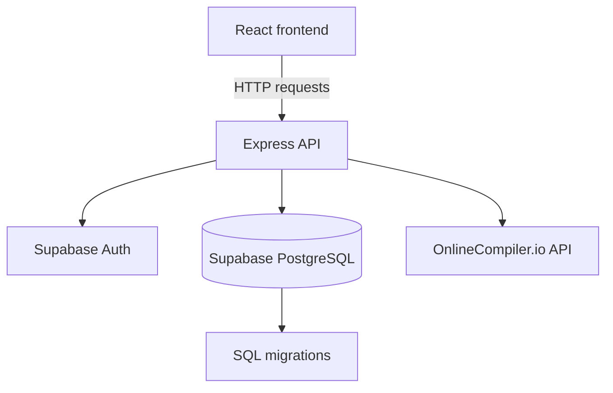

<div align="center">
  

  # Grader Samsen

  An online programming grader for students, teachers, and administrators at Samsen Wittayalai School.
</div>

## Overview

Grader Samsen provides a school-focused workspace for publishing programming problems, running student submissions against test cases, organizing classrooms, and reviewing coding activity. Students can join classrooms, solve problems, submit code, and review verdicts. Teachers and administrators can manage users, classrooms, problems, assignments, and classroom results.

See [Known limitations](#known-limitations) for deployment requirements.

## Features

- Username/password authentication with student, teacher, and administrator roles.
- Student classroom enrollment by code and teacher/admin classroom management.
- Programming problem authoring with difficulty, XP, tags, time and memory limits, PDF statements, and public or hidden test cases.
- In-browser code editing, sample runs, submissions, verdicts, runtime, memory, and per-test-case results.
- Code execution through the OnlineCompiler.io API for configured compiler runtimes.
- Assignments linked to classrooms and one or more problems.
- Progressive problem hints and personal progress by difficulty and topic.
- Teacher/admin views for users, classroom members, submissions, and submission analytics.
- XP, tiers, leaderboard data, profile settings, avatar data, dark mode, theme selection, and English/Thai UI translations.
- Supabase Auth and database migrations with row-level security policies.

## Quick start

### Requirements

- Node.js 20.x
- npm
- A Supabase project
- An OnlineCompiler.io API key for running or submitting code

### Install

From the repository root:

```bash
npm run install:all
```

This installs the root, frontend, and backend dependencies using the package lockfiles included in each package.

### Configure Supabase

1. Create a Supabase project.
2. Open the Supabase SQL Editor.
3. Run the migrations in `backend/supabase/migrations/` in numeric order.
4. Copy the backend environment template:

   ```bash
   cp backend/.env.example backend/.env
   ```

5. Replace the Supabase placeholders and compiler API placeholder in `backend/.env`.
6. Copy the frontend environment template:

   ```bash
   cp front-end/.env.example front-end/.env
   ```

The backend also creates `backend/.env` from its template on startup when the file does not exist, but it still requires real credentials before registration or other database-backed operations can work.

### Run locally

Start both development servers from the repository root:

```bash
npm run dev
```

- Frontend: <http://localhost:5173>
- Backend: <http://localhost:3001>
- Health check: <http://localhost:3001/health>

To run either service separately:

```bash
npm run dev:front
npm run dev:back
```

## Configuration

### Backend environment variables

Define these in `backend/.env`:

| Variable | Purpose | Default |
| --- | --- | --- |
| `BACKEND_PORT` | Port used by the Express server | `3001` |
| `PORT` | Fallback port when `BACKEND_PORT` is not set | `3001` |
| `FRONTEND_PORT` | Local frontend port used to derive the default CORS origin | `5173` |
| `FRONTEND_URL` | Frontend origin allowed by CORS | `http://localhost:5173` |
| `SUPABASE_URL` | Supabase project URL | — |
| `SUPABASE_ANON_KEY` | Supabase anonymous key | — |
| `SUPABASE_SERVICE_ROLE_KEY` | Supabase service-role key used by the backend | — |
| `ONLINE_COMPILER_API_KEY` | API key for code execution | — |
| `TEACHER_SIGNUP_KEY` | Optional invitation key for teacher registration | Built-in fallback exists in code; set this explicitly for deployments |

### Frontend environment variables

Define these in `front-end/.env`:

| Variable | Purpose | Default |
| --- | --- | --- |
| `FRONTEND_PORT` | Vite development-server port | `5173` |
| `BACKEND_PORT` | Used to derive the local API URL when `VITE_API_URL` is absent | `3001` |
| `VITE_API_URL` | API base URL used by the frontend | `http://localhost:3001` in development |

Do not commit either `.env` file. The repository ignores them; only the `.env.example` files should be shared.

## Usage

### Students

1. Register as a student or sign in.
2. Join a classroom with its seven-character classroom code.
3. Open a problem, write code in the editor, and review public test cases and submit the solution.
4. Review the overall verdict and individual test-case results in the problem workspace.
5. Review submissions, classroom assignments, profile information, and leaderboard data from the dashboard.

### Teachers and administrators

1. Register as a teacher with the configured teacher invitation key, or sign in with an existing account.
2. Create and manage classrooms, then share each generated classroom code with students.
3. Create or edit problems and their test cases.
4. Assign problems to a classroom and review members and submissions.
5. Use the administration views for user management and submission analytics.

## Architecture



- `front-end/` is a React 19 and Vite application. It provides authentication screens, student dashboard routes, teacher/admin routes, the code editor, and API client functions.
- `backend/` is an Express API written in TypeScript. It exposes authentication, classroom, problem, assignment, health, and submission endpoints.
- Supabase provides authentication and PostgreSQL storage. The SQL migrations create profiles, classrooms, memberships, problems, test cases, submissions, assignments, and avatar/plagiarism-related columns.
- The backend sends code and test-case input to OnlineCompiler.io, compares the returned output with the expected output, and stores the resulting submission data.

## Tech stack

| Layer | Technology |
| --- | --- |
| Frontend | React, TypeScript, Vite |
| UI | Tailwind CSS, Radix UI primitives, Framer Motion |
| State | Zustand |
| Backend | Node.js, Express, TypeScript |
| Authentication and database | Supabase Auth and PostgreSQL via `@supabase/supabase-js` |
| Code editor | Monaco Editor via `@monaco-editor/react` |
| Code execution | OnlineCompiler.io REST API |
| Charts | Recharts |
| Frontend deployment configuration | GitHub Pages workflow and Vercel routing configuration |

## Project structure

```text
.
├── front-end/
│   ├── src/
│   │   ├── components/       # Shared UI, editor, viewer, and layout components
│   │   ├── pages/            # Landing, auth, dashboard, and admin routes
│   │   ├── lib/              # API client, language templates, and utilities
│   │   ├── services/         # Frontend services
│   │   └── store/            # Zustand application state
│   ├── public/               # Static public assets
│   ├── .env.example
│   └── package.json
├── backend/
│   ├── src/
│   │   ├── routes/           # Auth, classroom, problem, and assignment routes
│   │   └── utils/            # Environment, caching, compiler, and username utilities
│   ├── api/index.ts          # Vercel function entry point
│   ├── supabase/migrations/  # Database schema and RLS policies
│   ├── .env.example
│   └── package.json
├── .github/workflows/        # GitHub Pages deployment workflow
├── package.json              # Root development and build scripts
└── homework_solution/        # Example C solution checked into the repository
```

## Development

Available root commands:

| Command | Description |
| --- | --- |
| `npm run dev` | Run frontend and backend development servers concurrently |
| `npm run dev:front` | Run only the frontend development server |
| `npm run dev:back` | Run only the backend development server |
| `npm run build` | Build the frontend and compile the backend TypeScript |
| `npm run install:all` | Install root, frontend, and backend dependencies |

Package-specific commands:

```bash
# Frontend linting
npm run lint --prefix front-end

# Frontend production preview, after building
npm run preview --prefix front-end

# Backend production start, after building
npm run start --prefix backend
```

There is currently no automated test script, formatter script, or Docker configuration in the repository.

## Deployment

The repository includes a GitHub Actions workflow at `.github/workflows/deploy.yml` that builds the frontend with Node.js 20 and deploys `front-end/dist` to GitHub Pages when changes are pushed to `main` or the workflow is started manually. The workflow sets `GITHUB_PAGES=true`, which changes the Vite base path to `/grader-samsen/`.

The backend includes a Vercel function entry point and `backend/vercel.json`, but this repository does not include a complete backend deployment workflow or provider-specific environment setup. Configure all backend secrets in the target hosting environment before deploying it.

## Known limitations

- The OnlineCompiler.io API is an external runtime dependency; code execution fails when `ONLINE_COMPILER_API_KEY` is missing or invalid.
- The repository does not contain automated tests, Docker files, or a deployment guide for the backend.
- No `LICENSE` file is present in the repository. Review and add the intended license before redistributing the project.

## Contributing

There is no repository-specific contribution guide yet. For local changes, create a branch, run the frontend lint command and the relevant build commands, then open a pull request with a clear description of the change and its verification.

